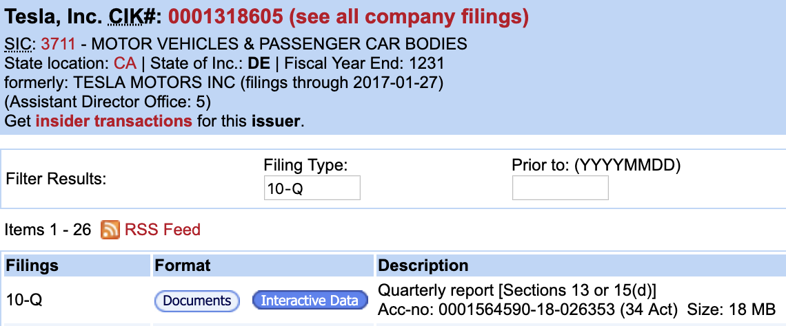

# Filer Status
Not all entities with a `CIK` identifier actively file financial statements (10-Ks / 10-Qs). We only care about the ones that do.

This library is used to determine whether an entity files financial statements or not.
- If a company does file financial statements, it receives an `active` filer status
- otherwise, it receives an `inactive` filer status
## Examples
### Active Filer – Tesla, Inc.

### Inactive Filer – Some guy named Kenneth Sawyer

